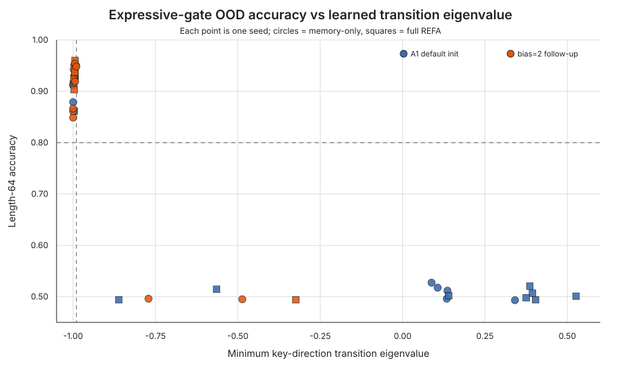

# A spectral capability cliff in keyed parity—but only near reflection

## Result in one paragraph

We tested whether expanding REFA's delta-rule write gate into the negative-eigenvalue
regime enables keyed parity state tracking. The originally proposed
"alternating support/opposition" task was rejected before testing because its final
polarity leaks the parity label. On a corrected leak-free keyed-parity task, the
preregistered default-initialization experiment was **inconclusive**: expressive gating
solved 5/10 memory-only seeds, while the other five never entered the negative-spectrum
basin. A fresh-seed, separately preregistered follow-up initialized the shared raw gate
bias from the spectrum equation. It passed its decision rule: expressive memory-only
accuracy at 4× training length was 0.893 median (IQR 0.852–0.943), versus 0.498
(0.488–0.504) current and 0.499 (0.485–0.511) safe. Full REFA reached 0.930
(0.921–0.935), while both controls remained near 0.50. The important qualification is
that merely becoming negative was not sufficient: success clustered near eigenvalue
-1. This is a small mechanistic result on synthetic symbols, not evidence for the
larger typed-memory or language-scale thesis.



## Question and corrected identification strategy

For normalized address `k`, a one-bank write has key-direction transition

`a = lambda - beta`,

with orthogonal directions decaying by `lambda`. Current and proximal-safe gates keep
`a` near the nonnegative interval. Expressive gating sets
`beta = (1 + lambda) sigmoid(g)`, making `a` capable of approaching -1 while retaining
the certified bound `|a| <= 1`.

The task interleaves two subject keys. All history rows use the identical SUPPORT token;
relation and object are fixed; the queried subject is revealed only in the final row.
The label is the parity of that subject's write count. Training histories have 16 writes
and OOD histories have 64. The primary diagnostic readout sees memory recall, the query
value, and their aligned coefficient, but cannot read the GRU workspace. The unchanged
full REFA composition is secondary.

This design removes three alternative explanations:

1. final-polarity leakage in the queued alternating-chain task;
2. parity counting by the shared GRU on the primary endpoint; and
3. additive triple-binding failure, which is not the hypothesis under test.

## Preregistered A1: default initialization

Configuration: `configs/parity_kill.yaml`; seeds 101–110; 18,954 parameters; 30 epochs;
2,048 training examples; ten seeds for every gate/readout condition.

| Memory-only gate | ID accuracy median | Length-64 median (IQR) | Runs >=0.80 | Median minimum eigenvalue |
|---|---:|---:|---:|---:|
| Current | 0.509 | 0.500 (0.496–0.512) | 0/10 | 0.173 |
| Safe | 0.514 | 0.498 (0.494–0.504) | 0/10 | 0.306 |
| Expressive | 0.741 | 0.703 (0.513–0.926) | 5/10 | -0.452 |

The preregistered verdict is `inconclusive_mechanism_not_engaged`. Five expressive runs
converged to minimum eigenvalues between -0.991 and -1.000 and scored 0.879–0.951 OOD.
The other five stayed positive and scored 0.493–0.527. Full REFA solved only 2/10
expressive seeds under default initialization. This is a basin-access failure, not a
robust architecture result.

## Fresh-seed gate-initialization follow-up

Configuration: `configs/parity_gate_init_followup.yaml`; seeds 201–210. The only
intervention was setting the raw write-gate bias to 2.0 in **every** gate mode. This was
derived before the run:

- expressive starts at `a ~= -0.762`;
- current starts at `a ~= 0.114`;
- safe starts at `a ~= 0.315`.

| Readout | Gate | Length-64 median (IQR) | Unseen-count median (IQR) | Runs >=0.80 |
|---|---|---:|---:|---:|
| Memory-only | Current | 0.498 (0.488–0.504) | 0.489 (0.482–0.501) | 0/10 |
| Memory-only | Safe | 0.499 (0.485–0.511) | 0.490 (0.484–0.509) | 0/10 |
| Memory-only | Expressive | **0.893 (0.852–0.943)** | **0.891 (0.838–0.935)** | 8/10 |
| Full REFA | Current | 0.500 (0.484–0.507) | 0.501 (0.484–0.514) | 0/10 |
| Full REFA | Safe | 0.497 (0.483–0.502) | 0.501 (0.481–0.504) | 0/10 |
| Full REFA | Expressive | **0.930 (0.921–0.935)** | **0.922 (0.918–0.926)** | 9/10 |

The follow-up passes every frozen primary condition: all ten expressive memory-only runs
had negative-eigenvalue fraction 1.0; median and Q25 exceeded 0.80 and 0.75; and the
median advantage over the better control was 0.394. The separately specified full-model
translation threshold also passed.

## New finding: sign is necessary here, but reflection proximity predicts retention

For repeated writes to one key, the parity-carrying transient scales as `a^n`. A
negative eigenvalue supplies the sign flip, but its magnitude determines whether that
period-2 signal survives length extrapolation: `0.77^64` is about `5.5e-8`, while
`0.99^64` is about `0.526`. Therefore "allow negative eigenvalues" is incomplete
engineering guidance; long parity requires a small **reflection margin**
`1 - |a|` as well.

This relationship was not a preregistered endpoint and is reported as post-hoc
descriptive evidence. Across both experiments and both readouts, 23/23 expressive runs
with minimum eigenvalue <= -0.99 solved the OOD task, versus 1/17 farther from -1. The
follow-up's two memory-only failures retained negative eigenvalues but only reached
-0.771 and -0.487; the full-model failure reached -0.324. A future independent test
should preregister reflection margin—not merely eigenvalue sign—as the causal variable.

## What the evidence establishes

- In this controlled keyed-memory probe, the current and proximal-safe transitions did
  not learn length-generalizing parity in any of 40 control runs.
- The expressive parameterization contains a learnable, contraction-certified solution.
- A spectrum-derived initialization changes practical access from 5/10 to 8/10 on the
  primary readout and from 2/10 to 9/10 in full REFA.
- The mechanism can survive composition with the present workspace/readout at this
  scale, but still has rare optimization failures.

## What it does not establish

- It does not validate typed support/opposition banks; the probe uses only SUPPORT
  writes and one bank.
- It does not show that negative eigenvalues improve ordinary revision, conflict,
  abstention, or text tasks.
- It does not test multi-bank soft routing, where route dilution can make the negative
  interval inaccessible.
- It does not demonstrate scaling beyond 18,954 parameters or transfer beyond synthetic
  subject keys.
- The reflection-proximity threshold is post hoc and needs independent confirmation.

## Reproduction and provenance

```bash
python -m pip install -e ".[dev]"
pytest
refa-edge parity-kill --config configs/parity_kill.yaml
refa-edge parity-kill --config configs/parity_gate_init_followup.yaml
python scripts/analyze_parity.py
```

Raw artifacts:

- `results/a1_keyed_parity/raw_results.json`
- `results/a1_gate_init_followup/raw_results.json`
- `results/a1_combined_analysis/summary.json`
- `results/a1_combined_analysis/all_runs.csv`

Both 60-run matrices passed the runtime contraction certificate. Total measured training
time was 2,047 seconds on a 10-logical-core ARM64 Mac, Python 3.12.14, PyTorch 2.13.0,
CPU only. The raw files record the parent commit, dirty-tree flag, and SHA-256 fingerprint
of the exact working source tree used for each phase.

## Next falsifying experiment

Preregister a reflection-margin parameterization on fresh seeds, then test it under
multi-bank routing and on the ordinary relational-revision battery. The architectural
claim should advance only if the parity gain survives without harming revision,
conflict, and abstention. Until then the result is best shared as a mechanism note and a
warning: an expressive spectral range is not the same as reliable optimizer access.
